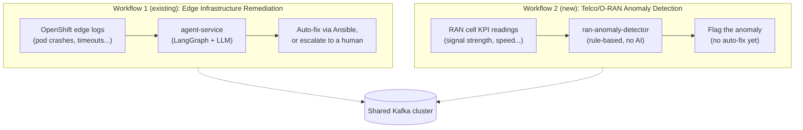
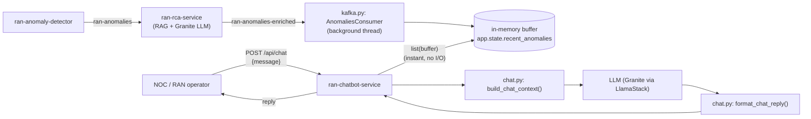
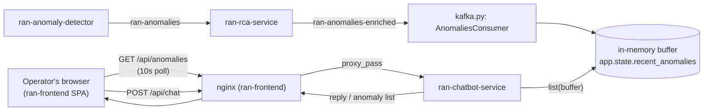

# Telco/O-RAN Anomaly Detection Workflow

This document explains, in plain language, the new Telco/O-RAN capability added to this
quickstart: what problem it solves, how data flows through it end to end, what role every
component plays, and — importantly — what was already built vs. what is brand new in this
task. It assumes **zero prior knowledge of O-RAN or telecom networking**.

---

## 1. The problem, in one sentence

This quickstart already watches OpenShift edge clusters for failures (crashing pods, timeouts,
etc.) and automatically fixes them. This new workflow does the equivalent thing for **cell
towers in a mobile network**: it watches a stream of radio-signal quality measurements and
automatically flags when a cell is behaving badly.

## 2. Background: RAN and O-RAN, in plain English

You don't need a telecom background to follow this. Here's everything required, in the fewest
words possible:

| Term | Plain-English meaning |
|---|---|
| **RAN** (Radio Access Network) | The part of a mobile network that connects phones to a cell tower — the antennas and radios. |
| **Cell** | One coverage unit of a tower (e.g. one antenna sector), broadcasting on a specific frequency **band**. |
| **O-RAN** (Open RAN) | An industry push to make RAN equipment open/interoperable instead of proprietary, so third-party software (including AI) can monitor and control it. |
| **UE** (User Equipment) | A phone or device connected to a cell. |
| **KPI** (Key Performance Indicator) | A measured number describing how well a cell is performing right now (signal strength, speed, etc.). |

The specific KPIs this workflow watches for every cell/band combination, once per reading:

| KPI | What it measures | "Bad" threshold used here |
|---|---|---|
| **RSRP** | Signal strength reaching the device (dBm, closer to 0 = stronger) | below **-110 dBm** |
| **RSRQ** | Signal cleanliness vs. interference/noise (dB) | used together with other signals to detect a full outage |
| **SINR** | How clearly the signal stands out above noise (dB, higher = better) | below **0 dB** |
| **Throughput** | Actual data speed delivered (Mbps) | drops **>50%** vs. the recent average |
| **UEs / PRB utilization** | How many devices are using the cell vs. its capacity | **>95%** capacity used, or usage changes **>50%** vs. recent average |
| *(all metrics at once)* | — | if UEs=0, throughput=0, and signal quality is very poor → the cell is probably **down** |

This domain model and its rule engine (`telco_oran.AnomalyDetector`) already existed before this
task — see [§6](#6-what-was-reused-vs-what-is-new-in-this-task) below. This document is about the
new pipeline that feeds live data into that rule engine.

---

## 3. The big picture: two independent workflows, one quickstart

This quickstart now runs **two separate, unrelated "watch for problems and act" pipelines** side
by side. They share the same Kafka cluster and the same Helm chart, but otherwise know nothing
about each other and can be turned on/off independently.



They are related in **infrastructure only**: both are deployed from the same `hub/helm` chart and
both use the same Kafka broker (just different topics). They are unrelated in **logic**: different
codebases, different Kafka consumer groups, different decision-making (LLM vs. plain Python
rules), and neither one calls or depends on the other at runtime.

---

## 4. Workflow 1 (existing, for context): Edge Infrastructure Remediation

This is the original pattern this quickstart was built around (see
[`docs/architecture.md`](architecture.md) and [`docs/graph-nodes.md`](graph-nodes.md) for full
detail). In short:

```
OpenShift edge logs
   → Kafka (system-alerts / noc-alerts)
   → agent-service (LangGraph state machine):
        normalize → rag_retrieval → analyze (LLM: IBM Granite) → decide
          ├─ remediate  → run an Ansible playbook via AAP
          ├─ lightspeed → LLM generates a new playbook, then runs it via AAP
          └─ escalate   → open a ServiceNow ticket
        → notify (Slack) → audit
   → Kafka (incident-audit)
```

Key trait: an **LLM decides** what's wrong and what to do about it, and the workflow **takes
real action** (runs Ansible, opens tickets).

---

## 5. Workflow 2 (new): Telco/O-RAN Anomaly Detection

### 5.1 What it does

It consumes a stream of RAN KPI readings, checks each one against a fixed set of deterministic
rules (no AI/LLM involved at all), and reports any anomalies it finds. It does **not** fix
anything yet — see [§7](#7-what-is-not-built-yet-future-work) for what comes next.

### 5.2 End-to-end flow

```mermaid
flowchart LR
    A["Cell KPI readings\n(CSV rows)"] -->|"published to"| B["Kafka topic:\nran-combined-metrics"]
    B -->|"polled by"| C["MetricsConsumer\n(background thread)"]
    C --> D["csv_mapper\nCSV row → Cell + RanKpiRecord"]
    D --> E["MetricsStore\nkeeps last 10 readings\nper (cell_id, band)"]
    E --> F["telco_oran.AnomalyDetector\n(6 deterministic rules)"]
    F -->|"anomaly found"| G["JSON anomaly record"]
    G --> H["logged + kept in memory"]
    H --> I["GET /anomalies\n(inspect recent results)"]
```



### 5.3 Walking through a real example

Imagine cell `42`, band `Band 29`, sends this reading on the `ran-combined-metrics` topic (a CSV
row — trimmed here to the relevant columns):

```
cell_id=42, band=Band 29, ..., rsrp=-125.0, sinr=15.0, throughput_mbps=50.0, ues_usage=10
```

Step by step:

1. **Kafka** delivers the raw CSV bytes to whichever consumer is listening (`ran-anomaly-detector`).
2. **`csv_mapper`** turns that row into a real `Cell` object (id 42, capacity, location, etc.) and
   a `RanKpiRecord` (the actual reading: rsrp=-125.0, sinr=15.0, ...).
3. **`MetricsStore`** looks up "cell 42 / Band 29", appends this new reading to its rolling
   history, and hands back a `CellBandMetrics` bundle (this reading + recent history).
4. **`AnomalyDetector`** checks all 6 rules against it. `-125.0 dBm < -110.0 dBm` → the Low RSRP
   rule fires. (Other rules don't fire here — SINR and throughput are healthy.)
5. The result is turned into this JSON record and logged / stored:

```json
{
  "cell_id": 42,
  "band": "Band 29",
  "anomaly_type": "LowRsrp",
  "anomaly": "Low RSRP: -125.0 dBm < -110.0 dBm"
}
```

A trend-based example — three healthy readings (50.00, 54.00, 60.25 Mbps, average 54.75) followed
by a reading of 18.89 Mbps (a >50% drop) — produces:

```json
{
  "cell_id": 42,
  "band": "Band 29",
  "anomaly_type": "ThroughputDrop",
  "anomaly": "Throughput Drop: 18.89 Mbps (Current) vs. 54.75 Mbps (Avg Prior) - drop > 50%"
}
```

This second example is exactly why the `MetricsStore` exists: a single reading can't tell you a
*trend* dropped — you need to remember the last few readings for that specific cell+band first.

A single bad-enough reading can also trigger **multiple** anomalies at once. A reading with
`ues_usage=0, throughput=0, sinr=-10.0, rsrp=-120.0, rsrq=-20.0` fires `CellOutage` **and**
`LowRsrp` **and** `SinrDegradation` simultaneously — the cell looks completely dead by every
measure.

---

## 6. What was reused vs. what is new in this task

This is the important part: almost everything about *how a problem is detected* already existed;
this task built the *pipeline that delivers real data to it and exposes the results*.

### Reused as-is (built in earlier work, not touched in this task)

- **`hub/telco-oran`** — the entire domain model and rule engine:
  - `Cell`, `RanKpiRecord`, `CellBandMetrics` (data shapes)
  - The 6 `Anomaly` types (`LowRsrp`, `SinrDegradation`, `ThroughputDrop`, `UesSpikeOrDrop`,
    `HighPrbUtilization`, `CellOutage`)
  - `AnomalyDetector` — the actual rule checks and thresholds
  - Used here purely as an installed library dependency; **zero lines of it were changed**.
- **The Kafka cluster itself** — same broker/deployment Workflow 1 already uses; only one new
  *topic* was added to it (`ran-combined-metrics`).
- **Architectural conventions copied from `agent-service`** — the threaded Kafka-consumer pattern,
  the FastAPI `/health` + `/ready` probe pattern, the two-stage `uv`-based `Containerfile` build,
  the Helm `Deployment`+`Service` template shape, and the Makefile image/build/test wiring style.
  These weren't reused *as code*, but the new service was deliberately built to match them so the
  codebase stays consistent.
- **The single `hub/helm` chart** — no new chart was created; new resources were added into the
  existing one.

### Newly built in this task

- **`hub/ran-anomaly-detector`** — an entirely new service/codebase:
  - `csv_mapper.py` — parses incoming CSV rows into `Cell`/`RanKpiRecord` objects (this format
    didn't exist anywhere before; it was designed for this task)
  - `metrics_store.py` — the rolling per-`(cell_id, band)` history buffer described above
  - `detection.py` — orchestrates parse → store → `AnomalyDetector` → JSON output
  - `kafka/consumer.py` — the background Kafka consumer for the new topic
  - `server.py` — FastAPI app (`/health`, `/ready`, `/anomalies`)
  - A CLI for trying it out locally without Kafka running at all
  - A full unit test suite
- **New Kafka topic**: `ran-combined-metrics` (added to `hub/helm/charts/kafka/values.yaml`)
- **New Helm resources**: a `Deployment` + `Service` for the service, gated behind a
  `ranAnomalyDetector.enabled` flag so operators can deploy this use case independently of
  everything else (this directly implements the team's decision, from the integration-planning
  discussion, to let each use case be deployed separately)
- **New Makefile wiring**: image variable, build target (with a non-standard build context — see
  below), and a `unit-tests` entry
- **A new build-context pattern**: this is the *first* service in the repo that depends on another
  local `hub/*` package (`telco-oran`), so its `Containerfile` is built with `hub/` as the context
  (not its own folder) so both packages are visible during the image build

### Explicitly not shared with Workflow 1

- Different Kafka topics, different consumer group, different container image, different Helm
  toggle. No runtime code path connects the two workflows.

---

## 7. What is *not* built yet (future work)

This task only covers **detection**. Two related pieces of work were scoped as separate, later
issues and are intentionally not part of this:

| Item | Status |
|---|---|
| **Vendor documentation RAG ingestion** | **Done** — see the note below the table. |
| **LLM-based root cause + recommended fix** | **Done** — see [`docs/telco-oran-rca.md`](telco-oran-rca.md). The `ran-rca-service` consumes detected anomalies, enriches them via RAG + Granite LLM, and publishes to `ran-anomalies-enriched`. |
| **Actual remediation** | Not yet built — nothing executes a real-world fix (e.g. adjusting antenna tilt); none of the three services take real-world action. |

**Note on persistence:** anomalies are only logged and kept in a small in-memory buffer
(`/anomalies`) — nothing is written to a database or object storage. Unlike the items above, this
is not deferred work: the original proposal's "results are persisted (database / S3)" acceptance
criterion was confirmed by the team to be a documentation error, not an actual requirement. The
in-memory approach is intentional and sufficient for this workflow as designed.

**Vendor documentation RAG ingestion, in detail:** [`hub/ingestion-pipeline`](../hub/ingestion-pipeline/)
(the same service Workflow 1 already used to ingest its runbooks) was extended, not replaced with
a new service, to also convert and chunk RAN/O-RAN vendor docs from
`hub/ingestion-pipeline/telco-docs/`, split into `mandatory/` (`gnodeb.pdf` — the Baicells gNodeB
manual, `ran_metrics_and_anomalies.docx`) and `optional/` (an OpenShift edge computing PDF,
included only when `TELCO_DOCS_INCLUDE_OPTIONAL=true`), into their own vector store,
`telco_oran_docs` (distinct from Workflow 1's
`noc_runbooks` store), configured via `TELCO_VECTOR_STORE_NAME` /
`hub/helm/values.yaml`'s `ingestionPipeline.telcoVectorStoreName`. With
`ingestionPipeline.autoIngestOnStartup: "true"` (the default), this vector store is populated
automatically on every deployment, which is exactly what `ran-rca-service` (below) queries.

**Update:** the "LLM-based root cause + recommended fix" row above is now built as its own
service, `ran-rca-service` — see [`docs/telco-oran-rca.md`](telco-oran-rca.md) for how it works,
and [§10](#10-the-chatbot-entrypoint-new-talking-to-detected-anomalies) below for the chatbot
entrypoint, which now consumes `ran-rca-service`'s real enriched output directly.

---

## 8. Component role reference

| Component | Role in Workflow 2 |
|---|---|
| **Kafka topic `ran-combined-metrics`** | The delivery pipe: decouples whatever produces KPI readings (a real network, or a simulator) from whatever consumes them. Any number of readings can be published without the consumer needing to be online at that exact moment. |
| **`MetricsConsumer`** | Runs in a background thread inside the service, continuously polling the topic and handing each message off for processing. |
| **`csv_mapper`** | Translates a raw, untyped CSV row (just text) into real, typed Python objects (`Cell`, `RanKpiRecord`) that the rest of the system understands. Skips and logs malformed rows instead of crashing. |
| **`MetricsStore`** | Short-term memory: keeps the last ~10 readings per cell+band so trend-based rules (throughput drop, usage spike) have something to compare against. |
| **`AnomalyDetector`** (from `telco_oran`) | The actual decision-maker — 6 fixed, deterministic rules, zero AI involved. Given the same input, always gives the same answer. |
| **FastAPI server (`/health`, `/ready`, `/anomalies`)** | `/health` and `/ready` let Kubernetes/OpenShift know the pod is alive and its Kafka connection is up (used for liveness/readiness probes). `/anomalies` is a simple window into what's been detected recently, for demos and debugging. |
| **Helm `enabled` toggle** | Lets an operator deploying this quickstart choose whether they want the Telco/O-RAN use case at all, independent of the edge-infrastructure workflow. |

For comparison, here's what the equivalent roles are in Workflow 1 (already existing, unchanged):

| Component | Role in Workflow 1 |
|---|---|
| **Kafka topics `system-alerts` / `noc-alerts`** | Same delivery-pipe role, but carrying OpenShift log events instead of KPI readings. |
| **LangGraph graph (`agent-service`)** | Plays the same "consume → process → produce a result" role as `ran-anomaly-detector`, but as a multi-step AI workflow instead of a straight rule check. |
| **IBM Granite (LLM)** | Makes the actual "what's wrong and what should we do" judgment call — the AI equivalent of `AnomalyDetector`, but non-deterministic and requires a model endpoint. |
| **AAP (Ansible Automation Platform)** | Executes the real-world fix. Workflow 2 has no equivalent yet. |
| **Kafka topic `incident-audit`** | Where the final outcome is published for compliance/audit — conceptually similar to what a future `ran-anomalies` topic or database could be for Workflow 2. |

---

## 9. Where to find things

| What | Where |
|---|---|
| Domain model & rule engine (reused, unchanged) | [`hub/telco-oran/`](../hub/telco-oran/) |
| New anomaly-detection service | [`hub/ran-anomaly-detector/`](../hub/ran-anomaly-detector/) |
| Vendor doc RAG ingestion (`telco_oran_docs` vector store, done) | [`hub/ingestion-pipeline/`](../hub/ingestion-pipeline/) (extended, not a new service) |
| Root cause analysis service (RAG + Granite LLM) | [`hub/ran-rca-service/`](../hub/ran-rca-service/), see [`docs/telco-oran-rca.md`](telco-oran-rca.md) |
| Chatbot entrypoint (see [§10](#10-the-chatbot-entrypoint-new-talking-to-detected-anomalies)) | [`hub/ran-chatbot-service/`](../hub/ran-chatbot-service/) |
| RAN webapp (see [§11](#11-the-ran-webapp-new-visualizing-and-chatting-with-detected-anomalies)) | [`hub/ran-frontend/`](../hub/ran-frontend/) |
| Demo trigger + recording script (see [§11.5](#115-demo-trigger)) | [`docs/RAN-DEMO-SCRIPT.md`](RAN-DEMO-SCRIPT.md) |
| New Kafka topic definitions | [`hub/helm/charts/kafka/values.yaml`](../hub/helm/charts/kafka/values.yaml) |
| New Helm Deployment/Service (detector) | [`hub/helm/templates/ran-anomaly-detector.yaml`](../hub/helm/templates/ran-anomaly-detector.yaml) |
| New Helm Deployment/Service (RCA) | [`hub/helm/templates/ran-rca-service.yaml`](../hub/helm/templates/ran-rca-service.yaml) |
| New Helm Deployment/Service (chatbot) | [`hub/helm/templates/ran-chatbot-service.yaml`](../hub/helm/templates/ran-chatbot-service.yaml) |
| New Helm Deployment/Service/Route (webapp) | [`hub/helm/templates/ran-frontend.yaml`](../hub/helm/templates/ran-frontend.yaml) |
| New Helm values blocks | [`hub/helm/values.yaml`](../hub/helm/values.yaml) (`ranAnomalyDetector:`, `ranRcaService:`, `ranChatbotService:`, and `ranFrontend:` sections) |
| Existing edge-infrastructure workflow | [`docs/architecture.md`](architecture.md), [`docs/graph-nodes.md`](graph-nodes.md) |

Try it locally without any Kafka/OpenShift setup:

```bash
cd hub/ran-anomaly-detector
uv sync --group dev
uv run ran-anomaly-detector          # runs a built-in sample and prints detected anomalies
uv run pytest                        # full test suite
```

---

## 10. The chatbot entrypoint (new): talking to detected anomalies

### 10.1 What it is

`hub/ran-chatbot-service` is a thin conversational entrypoint — a FastAPI "backend-for-frontend"
(BFF) exposing `POST /api/chat` — so an operator can ask about recently detected RAN anomalies in
natural language ("What's wrong with cell 42?") instead of reading raw JSON. It follows the same
pattern as the existing NOC chatbot (`hub/chatbot-service`) built for Workflow 1, but is a fully
independent service: different codebase, different Kafka topics, different persona/prompt, its
own `enabled` toggle in Helm — it shares no domain/runtime code path with `hub/chatbot-service`,
`ran-anomaly-detector`, or `ran-rca-service`. The two chatbot services do share one thing: a
handful of domain-free infrastructure helpers (`utc_now`, `normalize_session_id`, `build_deps`,
`probe_http`, in `shared.utils`/`shared.probes`) factored out into [`hub/shared`](../hub/shared/),
a local package depended on via a `uv` path source, so fixes to that plumbing aren't duplicated
across services. `ran-anomaly-detector` and `ran-rca-service` depend on the same `hub/shared`
package for its Kafka consumer (`shared.kafka.TopicConsumer`) and RAG client
(`shared.rag.RagClient`) modules.

It is deliberately a **thin channel layer**: it does not detect anomalies or perform root cause
analysis itself. All of that domain logic lives upstream — `ran-anomaly-detector` (detection) and
`ran-rca-service` (LLM root cause analysis + RAG-based recommended fix, now built — see
[`docs/telco-oran-rca.md`](telco-oran-rca.md)). This service only turns already-enriched anomaly
data into a conversational reply.

### 10.2 How it consumes `ran-rca-service`'s output

[`kafka.py`](../hub/ran-chatbot-service/src/ran_chatbot_service/kafka.py)'s `AnomaliesConsumer` is a
single background thread, started at app startup, that owns the `ran-anomalies-enriched` Kafka
connection (`ENRICHED_ANOMALIES_TOPIC`, wired as an environment variable in
[`config.py`](../hub/ran-chatbot-service/src/ran_chatbot_service/config.py) and in Helm) and
continuously fills an in-memory buffer (`deque(maxlen=ENRICHED_ANOMALIES_MAX_MESSAGES)`) — the same
background-thread-plus-buffer pattern already used by `ran-anomaly-detector`'s `MetricsConsumer`.
`POST /api/chat` just reads that buffer directly (an instant in-memory operation, no Kafka I/O on
the request path at all). On connect (and on every reconnect), it seeks each partition back a
bounded window and drains it so the buffer is pre-populated with recent history immediately,
instead of only filling in as new anomalies trickle in. It deliberately does **not** use a Kafka
consumer group: the topic has multiple partitions, and a shared group would split them across
`ran-chatbot-service` replicas if ever scaled beyond one, giving each replica only a partial view —
staying group-less means every replica independently sees the full topic. Each record matches
`contracts/ran-anomaly-enriched.schema.json`, produced by `ran-rca-service` exactly like this:

```json
{
  "cell_id": 42,
  "band": "Band 29",
  "anomaly_type": "LowRsrp",
  "anomaly": "Low RSRP: -125.0 dBm < -110.0 dBm",
  "root_cause": "Low RSRP typically indicates poor radio conditions, possibly due to distance, interference, or physical obstructions.",
  "recommended_fix": "Refer to Baicells documentation Section 4.2, Page 15 — Antenna Tilt Adjustment"
}
```

If Kafka is unreachable or the topic has no messages yet, the buffer just stays empty and
`AnomaliesConsumer.is_connected` reports `false` (surfaced as `kafka: false` in `/api/chat`'s
`_deps` envelope and in `/ready`) rather than failing the request — the LLM still replies, just
without anomaly context.

### 10.3 End-to-end flow



### 10.4 What was out of scope for this entrypoint (now built, see §11)

No frontend/UI work was included in this entrypoint's own task — a dedicated O-RAN web dashboard
was scoped as a separate, later task. That dashboard is now built; see
[§11](#11-the-ran-webapp-new-visualizing-and-chatting-with-detected-anomalies) below for
`hub/ran-frontend`, which also motivated adding one new read-only endpoint here,
`GET /api/anomalies` (see §11.2).

`ran-chatbot-service` remains directly testable via its REST API (`POST /api/chat`,
`GET /api/anomalies`), and has black-box integration test coverage in
[`hub/integration-tests/tests/telco/ran_chatbot_service/`](../hub/integration-tests/tests/telco/ran_chatbot_service/)
(run via `make integration-tests` against a deployed cluster, alongside `hub/chatbot-service`'s
equivalent suite), on top of its own unit tests in `hub/ran-chatbot-service/tests/`.

---

## 11. The RAN webapp (new): visualizing and chatting with detected anomalies

### 11.1 What it is

`hub/ran-frontend` is a small React webapp — a live anomaly feed plus a chat panel — sitting on
top of `ran-chatbot-service`. It follows the exact same convention as every other piece of this
initiative: a fully **independent twin** of an existing NOC-workflow component, here
`hub/frontend` (the NOC dashboard). Same stack (React 19 + Vite 6, no router, no UI framework,
native `fetch`, nginx-unprivileged in production, relative `/api/*` calls proxied to its BFF),
same overall shape, but a separate codebase, separate Helm Deployment/Service/Route, and its own
`ranFrontend.enabled` toggle — it shares no runtime code path with `hub/frontend` or
`hub/chatbot-service`. See [`hub/ran-frontend/README.md`](../hub/ran-frontend/README.md) for the
full stack/structure writeup.

Because `ran-chatbot-service` is much thinner than `hub/chatbot-service` (no
`/api/summary`/`/api/integrations`/`/api/demo/trigger` equivalents), this webapp is
correspondingly focused: a header metrics strip, a live anomaly list, and a chat panel — no
integration matrix, SLO panel, business-impact panel, incident timeline, or demo triggers, since
there's no matching data source for any of those in this workflow (yet).

### 11.2 The new `GET /api/anomalies` endpoint

The only backend change this webapp required: `ran-chatbot-service` already kept a live,
in-memory buffer of enriched anomalies (`app.state.recent_anomalies`, filled by the background
`AnomaliesConsumer` described in §10.2) purely to build LLM chat context — nothing exposed that
buffer over HTTP directly. `GET /api/anomalies` exposes it read-only, newest first, with the same
`_deps` envelope convention as `/api/chat`:

```json
{
  "_deps": { "status": "ok" },
  "count": 2,
  "anomalies": [
    {
      "cell_id": 42,
      "band": "Band 29",
      "anomaly_type": "LowRsrp",
      "anomaly": "Low RSRP: -125.0 dBm < -110.0 dBm",
      "root_cause": "Low RSRP typically indicates poor radio conditions...",
      "recommended_fix": "Refer to Baicells documentation Section 4.2, Page 15..."
    }
  ]
}
```

No new Kafka consumption and no new dependency: it's purely a read of state that already existed,
so `_deps` here only ever reflects `kafka` (no LLM call happens on this path).

### 11.3 End-to-end flow



### 11.4 Where to find things

| What | Where |
|---|---|
| RAN webapp source | [`hub/ran-frontend/`](../hub/ran-frontend/) |
| RAN webapp docs | [`hub/ran-frontend/README.md`](../hub/ran-frontend/README.md) |
| New `GET /api/anomalies` endpoint | [`hub/ran-chatbot-service/src/ran_chatbot_service/__init__.py`](../hub/ran-chatbot-service/src/ran_chatbot_service/__init__.py) |
| New Helm Deployment/Service/Route (webapp) | [`hub/helm/templates/ran-frontend.yaml`](../hub/helm/templates/ran-frontend.yaml) |
| New Helm values block | [`hub/helm/values.yaml`](../hub/helm/values.yaml) (`ranFrontend:`) |

### 11.5 Demo trigger

The webapp's **Demo Mode** panel (`hub/ran-frontend/src/components/DemoTrigger.jsx`) calls a new
`POST /api/demo/trigger` on `ran-chatbot-service` — the same pattern as `hub/chatbot-service`'s own
demo trigger for Workflow 1 (see [§10](#10-the-chatbot-entrypoint-new-talking-to-detected-anomalies)):
the BFF publishes straight to the real input topic (`ran-combined-metrics`) rather than calling any
other RAN service directly, and everything downstream is the real, already-running pipeline.
Unlike Workflow 1's JSON log events, the payload here is a single-row **CSV** blob matching
`ran-anomaly-detector`'s expected column format
(`hub/ran-chatbot-service/src/ran_chatbot_service/demo.py`).

Two scenarios, using reserved `cell_id`s (`9001`/`9002`) so demo data is unmistakable in the UI:

| Scenario | Fires | Cell |
|---|---|---|
| `low_signal` (default) | `LowRsrp` only | `9001` |
| `cell_outage` | `CellOutage` + `LowRsrp` + `SinrDegradation` (independently RCA'd, so they land staggered over ~45-60s) | `9002` |

**Prerequisite:** the RAN anomaly pipeline (`ranAnomalyDetector`, `ranRcaService`,
`ranChatbotService`) and this webapp (`ranFrontend`) are all part of the Telco/O-RAN use case and
are enabled by default via `global.telcoOran.enabled`. They deploy together whenever Telco/O-RAN is
on (`ENABLE_TELCO_ORAN=true`, the default, via Make; or `--set global.telcoOran.enabled=true` via
raw Helm) and are skipped entirely when it's off. To toggle a single service without disabling the
whole use case, override its own flag, e.g. `--set ranFrontend.enabled=false`.

See [`docs/RAN-DEMO-SCRIPT.md`](RAN-DEMO-SCRIPT.md) for a full recording walkthrough (voiceover,
timing, troubleshooting) covering both scenarios.
