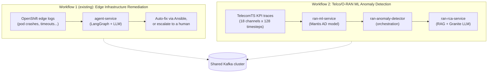
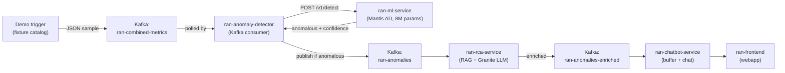

# Telco/O-RAN Anomaly Detection Workflow

This document explains, in plain language, the Telco/O-RAN capability in this quickstart: what
problem it solves, how data flows through it end to end, what role every component plays, and how
ML-based detection works. It assumes **zero prior knowledge of O-RAN or telecom networking**.

---

## 1. The problem, in one sentence

This quickstart already watches OpenShift edge clusters for failures (crashing pods, timeouts,
etc.) and automatically fixes them. This workflow does the equivalent thing for **5G mobile
networks**: it uses an ML model (Mantis AD) to detect anomalies in KPI time-series traces and
automatically diagnoses them via LLM.

## 2. Background: RAN and O-RAN, in plain English

You don't need a telecom background to follow this. Here's everything required:

| Term | Plain-English meaning |
|---|---|
| **RAN** (Radio Access Network) | The part of a mobile network that connects phones to a cell tower — the antennas and radios. |
| **O-RAN** (Open RAN) | An industry push to make RAN equipment open/interoperable instead of proprietary, so third-party software (including AI) can monitor and control it. |
| **KPI** (Key Performance Indicator) | A measured number describing how well the network is performing right now. |
| **TelecomTS** | A public 5G observability dataset (32K samples, 18 KPI channels, 128 timesteps each at 10Hz) used to train and evaluate the ML model. |

The 18 KPI channels this workflow processes (from the TelecomTS dataset):

| Layer | KPIs |
|---|---|
| **PHY** | RSRP, UL_SNR |
| **MAC** | DL_BLER, DL_MCS, UL_BLER, UL_MCS, UL_NPRB |
| **Network** | TX_Bytes, RX_Bytes, Estimated_UL_Buffer, UL_NumberOfPackets, DL_NumberOfPackets |
| **Radio** | PRBs_DL_Current, PRBs_UL_Current, PRB_Utilization_DL, PRB_Utilization_UL |
| **Protocol** | UL_Protocol (TCP/UDP/None), DL_Protocol (TCP/UDP/None) |

---

## 3. The big picture: two independent workflows, one quickstart

This quickstart runs **two separate, unrelated "watch for problems and act" pipelines** side
by side. They share the same Kafka cluster and the same Helm chart, but otherwise know nothing
about each other and can be turned on/off independently.



---

## 4. Workflow 1 (existing, for context): Edge Infrastructure Remediation

This is the original pattern this quickstart was built around (see
[`docs/architecture.md`](architecture.md) and [`docs/graph-nodes.md`](graph-nodes.md)). In short:

```
OpenShift edge logs
   → Kafka (system-alerts / noc-alerts)
   → agent-service (LangGraph state machine):
        normalize → rag_retrieval → analyze (LLM: IBM Granite) → decide
          ├─ remediate  → run an Ansible playbook via AAP
          ├─ lightspeed → LLM generates a new playbook, then runs it via AAP
          └─ escalate   → open a ServiceNow ticket
        → notify (Slack) → audit
   → Kafka (incident-audit)
```

Key trait: an **LLM decides** what's wrong and what to do about it, and the workflow **takes
real action** (runs Ansible, opens tickets).

---

## 5. Workflow 2: Telco/O-RAN ML Anomaly Detection

### 5.1 What it does

It consumes TelecomTS 5G KPI traces (JSON samples, 128 timesteps × 18 channels), runs them
through a pretrained ML model (Mantis-8M fine-tuned for binary anomaly detection), and for
anomalous windows: publishes them for LLM-based root cause analysis and recommended fix.

### 5.2 End-to-end flow



### 5.3 Walking through a real example

A presenter clicks "Antenna Failure" in the webapp's Demo Mode panel. Here's what happens:

1. **`ran-chatbot-service`** loads the `antenna_failure.json` fixture from the checked-in catalog
   (a real TelecomTS sample: 128 timesteps × 18 KPIs, from the public HuggingFace dataset) and
   publishes it as JSON to `ran-combined-metrics` with a generated `incident_id`.

2. **`ran-anomaly-detector`** polls that message, deserializes the JSON, extracts the `kpi_window`
   (128 × 18 values), and POSTs it to `ran-ml-service` (configured via `RAN_ML_SERVICE_URL`):
   ```
   POST <ran-ml-service-url>/v1/detect
   { "kpi_window": [ /* 128 timestep objects */ ] }
   ```

3. **`ran-ml-service`** preprocesses the window (Protocol encoding, no z-score for AD), runs
   it through the Mantis encoder (per-channel processing → mean-pool → classification head),
   and returns:
   ```json
   { "label": "anomalous", "confidence": 0.9995, "class_index": 1 }
   ```

4. **`ran-anomaly-detector`** sees `label=anomalous`, builds the output record, and publishes
   to `ran-anomalies`:
   ```json
   {
     "incident_id": "a3f7c2d1",
     "zone": "A",
     "application": "File",
     "kpi_window": [ /* full 128 × 18 window */ ],
     "ad_label": "anomalous",
     "ad_confidence": 0.9995
   }
   ```

5. **`ran-rca-service`** consumes this, queries the `telco_oran_docs` vector store for relevant
   vendor documentation, sends the context to Granite LLM, and publishes an enriched record with
   `root_cause` and `recommended_fix` to `ran-anomalies-enriched`.

6. **`ran-chatbot-service`** picks it up in its background consumer, buffers it, and the webapp
   displays it with the LLM's diagnosis.

If the presenter clicks "Normal Traffic" instead, step 3 returns `label=normal` and step 4
**does not publish** — nothing reaches the dashboard. The model correctly filters the ~96%
of normal traffic.

---

## 6. The ML model: Mantis AD

| Property | Value |
|---|---|
| Architecture | MantisV1 transformer encoder (per-channel + mean-pooling) |
| Backbone | `paris-noah/Mantis-8M` (pretrained on CauKer 2M synthetic time series) |
| Parameters | 8.1M |
| Fine-tuned on | TelecomTS (25,600 training samples, 80/20 split, seed=42) |
| Task | Binary classification: normal (0) vs anomalous (1) |
| Accuracy | 99.5% |
| Macro F1 | 0.97 |
| Anomaly Precision/Recall | 92% / 98% |
| Inference | CPU-only, ~5ms per sample |
| Serving | FastAPI (`ran-ml-service`), port 8080 |
| Weights | Fine-tuned `.pt` checkpoint loaded from `MANTIS_MODEL_PATH`; HuggingFace backbone (`paris-noah/Mantis-8M`) baked into the OCI image |

The model was trained by Alan (see PR #127) using the TelecomTS benchmark pipeline with
inverse-frequency class weights for the 96/4 normal/anomaly imbalance.

---

## 7. Component role reference

| Component | Role |
|---|---|
| **`ran-ml-service`** | Self-contained ML predictor (lives in `model-serving/ran-ml-service/`, decoupled from the hub chart). Serves the Mantis AD model via `POST /v1/detect` (128×18 kpi_window → `anomalous`/`normal` + confidence). Deployed as a KServe `InferenceService` or standalone container. `/ready` requires model loaded. |
| **`ran-anomaly-detector`** | Kafka consumer + orchestrator. Deserializes JSON samples, calls the predictor, publishes only anomalous windows. `/ready` requires both Kafka and predictor. |
| **`ran-rca-service`** | LangGraph pipeline (rag_retrieval → analyze). Adds `root_cause` + `recommended_fix` via RAG + Granite LLM. |
| **`ran-chatbot-service`** | Thin BFF. Buffers enriched anomalies, exposes `/api/chat` + `/api/anomalies` + `/api/demo/trigger`. |
| **`ran-frontend`** | React webapp. Scenario buttons, anomaly table, chat panel. |
| **`telco-oran` (fixture catalog)** | Checked-in TelecomTS samples for reproducible demos. No live HuggingFace fetch at click time. |
| **Kafka topics** | `ran-combined-metrics` (input), `ran-anomalies` (detector → RCA), `ran-anomalies-enriched` (RCA → chatbot) |

---

## 8. Where to find things

| What | Where |
|---|---|
| ML predictor service | [`model-serving/ran-ml-service/`](../model-serving/ran-ml-service/) (self-contained, decoupled from hub) |
| Training notebook | [`model-serving/training/notebooks/telecomts_model_evaluation.ipynb`](../model-serving/training/notebooks/telecomts_model_evaluation.ipynb) |
| Anomaly detection orchestrator | [`hub/ran-anomaly-detector/`](../hub/ran-anomaly-detector/) |
| Root cause analysis service | [`hub/ran-rca-service/`](../hub/ran-rca-service/), see [`docs/telco-oran-rca.md`](telco-oran-rca.md) |
| Chatbot entrypoint | [`hub/ran-chatbot-service/`](../hub/ran-chatbot-service/) |
| RAN webapp | [`hub/ran-frontend/`](../hub/ran-frontend/) |
| TelecomTS fixture catalog | [`hub/telco-oran/src/telco_oran/fixtures/`](../hub/telco-oran/src/telco_oran/fixtures/) + `catalog.py` |
| Contracts | [`contracts/ran-anomalies.schema.json`](../contracts/ran-anomalies.schema.json), [`contracts/ran-anomaly-enriched.schema.json`](../contracts/ran-anomaly-enriched.schema.json) |
| Helm templates | `hub/helm/templates/ran-*.yaml` |
| Helm values | [`hub/helm/values.yaml`](../hub/helm/values.yaml) (`ranAnomalyDetector:`, `ranRcaService:`, `ranChatbotService:`, `ranFrontend:`) |
| Demo recording script | [`docs/RAN-DEMO-SCRIPT.md`](RAN-DEMO-SCRIPT.md) |

---

## 9. What is *not* built yet (future work)

| Item | Status |
|---|---|
| **Binary anomaly detection (ML)** | **Done** — Mantis AD via `ran-ml-service` (this ticket, APPENG-6023) |
| **10-class root cause classification (ML)** | Planned — APPENG-6062. Same predictor image, `TASK=classify`, second InferenceService |
| **Vendor documentation RAG ingestion** | **Done** — `hub/ingestion-pipeline` populates `telco_oran_docs` vector store |
| **LLM-based root cause + recommended fix** | **Done** — `ran-rca-service` (RAG + Granite) |
| **Actual remediation** | Not yet built — nothing executes a real-world fix |
| **Background replay / live data feed** | Not yet — demos use on-demand fixture injection only |
| **GPU serving** | Not needed for demo scale (CPU inference ~5ms) |

---

## 10. Key design decisions

1. **One sample = one Kafka message** — not a rolling stream, not CSV rows, not a 10Hz tick.
2. **Only anomalous windows are published** — the ~96% normal traffic is silently dropped.
3. **Identity is `incident_id` + zone/application** — not cell_id/band/anomaly_type (those are
   rule-engine concepts that don't apply to ML-based detection).
4. **Detect is mandatory** — the detector's `/ready` probe requires the predictor. No skip flag.
5. **Self-contained image** — the OCI image contains the FastAPI app, model architecture, and
   the HuggingFace backbone (`paris-noah/Mantis-8M`) baked in (`HF_HUB_OFFLINE=1`).
   Fine-tuned task weights are loaded at startup from `MANTIS_MODEL_PATH`.
6. **Same image for detect and classify** — APPENG-6062 adds `TASK=classify` to the same
   `ran-ml-service` image with a different artifact and InferenceService.
7. **Fixtures are checked in** — demos don't fetch from HuggingFace at click time.
